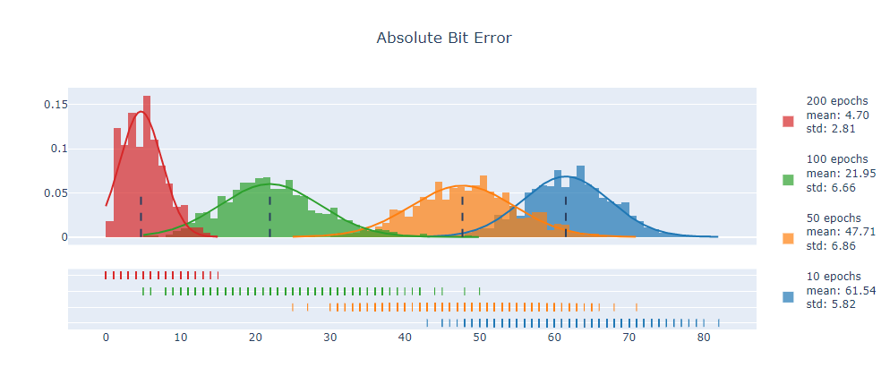
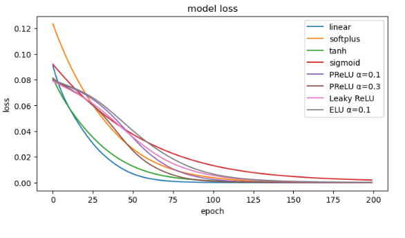

###Project Description
***
A code for the publication in [IEEE TCSET 2022](http://tcset.ieee.org.ua/) conference

>**Two-Stage AES Encryption Method Based on Stochastic Error of a Neural Network.**

While the article is not published yet, in case of necessity please refer to this Github repository:

>Roman Peleshchak, Vasyl Lytvyn, Nataliia Kholodna, Ivan Peleshchak, Victoria Vysotska.
>Two-Stage AES Encryption Method Based on Stochastic Error of a Neural Network. (2022), GitHub repository.

###### (not necessarily in this form)

You can familiarise yourself with the **main concepts** via **[this presentation](https://docs.google.com/presentation/d/1WRPRrL_rs232LJMM8mtBHYHIaKSGB9XI/edit?usp=sharing&ouid=106111675070305454051&rtpof=true&sd=true)**.

###Project Structure
***
The project consists of the following files:
```
.
├── experiments.py          # Perform tests on cryptosystem
├── models.py               # Feed-forward neural network models
├── plots.ipynb             # Plot the distribution of errors 
├── test_cryptosystem.py    # Basic cryptosystem test
├── test_encryption.py      # Test AES encryption, decryption
├── utils.py                # Helper functions
└── README.md
```
⟶`experiments.py`

Explore the properties of AES cryptosystem: 
- mean error / loss, time for n attempts;
- average time to train based on number of hidden layers;
- average error / loss based on number of training epochs and learning rate;
- correlation between absolute bit error and mean squared error;
- deciphering error rate based on the structure of a neural network.

⟶`models.py`

Deel learning models based on Keras (Tensorflow API):
- encrypt plaintext with `.predict()` by forward propagation;
- decrypt ciphertext with `.reverse()` by reversing the neural network;
- class `Model11` allows to iteratively add hidden layers and apply activation function;
- other models are manually constructed to test different combinations '_num hidden layers_ ⟷ _activation functions_'.

⟶`plots.ipynb`

Stochastic nature of a neural network allows to get different results per each attempt of encryption:

The graph above shows that for training the model for a larger number of epochs the cryptosystem gets less stochastic.

To replicate the results of an AES encryption, it is suggested to stop training the model when the loss begins to decrease in a linear manner (≈ 50-100 epochs):



⟶`test_cryptosystem.py`

Pipeline for text encryption and decryption. 

Encrypt and decrypt text with the neural network, print out the results.

⟶`utils.py`

Contains the following helper functions:
- decorator for logging time of function execution;
- converting array of bytes to string of bits;
- padding or cropping a string;
- AES text encryption and decryption;
- converting text in a suitable for neural network format;
- inverse activation functions.

###Docker 
***
Main file `test_cryptosystem.py` can be launched in a Docker container.

⟶ Pull an image from a registry:

```docker pull nknknk3000/two-stage_aes:1.0```

⟶ Start a new container from an image:

```docker run nknknk3000/two-stage_aes:1.0```
***


Updates are coming soon!